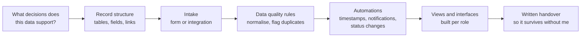

# Airtable Systems

`CLIENT ENGAGEMENT RECORD`

**Project type:** Client engagement record — deliberately not a technical case study
**Evidence:** three completed Airtable client engagements, plus one documented
Make.com + Airtable troubleshooting engagement

---

## What this repository is, and what it is not

I have completed **three Airtable client projects**. This page records that
truthfully and says what transfers to the next one.

It is **not** a case study, because a case study is mostly *how* — the base
schema, the automations, the interface design — and that belongs to the clients
who paid for it. Implementation details are intentionally omitted because those
production systems are private. What I will do is walk a prospective client
through the relevant details in a call.

I would rather publish a short honest page than a long invented one.

## Engagements

| # | Work | What is published |
|---|---|---|
| 1 | Airtable client project — Airtable systems and workflows | Completed. Internals private. |
| 2 | Airtable client project — Airtable systems and workflows | Completed. Internals private. |
| 3 | Airtable client project — Airtable systems and workflows | Completed. Internals private. |
| 4 | **Make.com + Airtable automation failure — troubleshooting** | Documented in full. See below. |

## The one Airtable engagement I can describe in detail

An automation had stopped firing. The Make.com scenario was fine; nothing in the
logic had changed. The fault was a **stale Airtable View ID** — the view the
trigger was watching had been replaced, so the scenario was politely polling
something that no longer existed.

That is the shape most "broken automation" jobs take. Nothing is wrong with the
logic; something it *refers to* has moved, and the platform's error message does
not say so. The fix is tracing the reference, not rebuilding the workflow.

Written up in full in
**[technical-troubleshooting-case-studies](https://github.com/skmalikllc/technical-troubleshooting-case-studies)**
and **[automation-client-case-studies](https://github.com/skmalikllc/automation-client-case-studies)**.

It is also the reason I treat **view, table and field IDs as external
dependencies** on every Airtable build, and note them in the handover
documentation rather than leaving them implicit.

## How I approach an Airtable build

This is my method, not a diagram of any client's base.

Four opinions behind it:

- **The record structure follows the decisions**, not the spreadsheet it is
  being migrated from. A column that exists because someone once needed it is
  not a field.
- **Interfaces per role, not one giant table.** A board member who opens a
  47-column grid closes it again. The base can be complex; what each person sees
  should not be.
- **External IDs are dependencies.** Views, tables, fields and any linked
  automation ID get written down. See the engagement above for why.
- **A system that needs me is not finished.** Written handover is part of the
  build, not an upsell.

## Duplicate handling in Airtable — where I am strongest

Duplicate prevention is the part of an Airtable build I pay most attention to,
and it is what I actually specialise in outside Airtable as well.

The principles carry across any database:

- **An exact key is authoritative.** A registration number, EIN or account code
  should be normalised — strip the punctuation — and then a match is a match.
- **A name is not a key.** "St. Mary's Foundation", "St Marys Foundation Inc"
  and "Saint Mary's Fdn" are one organisation. Comparing those needs
  normalisation first, not a plain equals.
- **A name-only match warns; it never auto-merges.** Wrongly merging two records
  costs far more than a human glancing at a flag.
- **Merges report their conflicts.** If two records disagree on a phone number,
  the system should say so rather than silently pick one.

I have published and tested that logic as an open-source tool:
**[contact-dedupe-mcp](https://github.com/skmalikllc/contact-dedupe-mcp)** —
9 unit tests plus an end-to-end test, CI green on Node 20/22/24. The full
method across every platform is in
**[data-sync-dedup-reconciliation](https://github.com/skmalikllc/data-sync-dedup-reconciliation)**.

**To be precise about this: `contact-dedupe-mcp` is not an Airtable
implementation and is not presented as one.** It is evidence of how the matching
is reasoned about, not a base I built for anyone.

## Related capability, honestly scoped

| Area | Level supported by evidence |
|---|---|
| Airtable bases, fields, relationships, views | Three completed client engagements |
| Airtable automations and interfaces | Where they formed part of those engagements; details private |
| Airtable + Make.com integration and troubleshooting | One documented engagement, described above |
| Duplicate detection and data-quality design | Strong — published, tested, open source |
| Formstack | **No.** No verified Formstack work. Stated plainly rather than implied. |
| Airtable scripting extensions / custom apps | Not claimed. |

## Privacy

No client names, base schemas, field names, record data, API keys, base IDs or
screenshots of client systems appear here or anywhere in this portfolio.

---

Part of **[automation-portfolio](https://github.com/skmalikllc/automation-portfolio)**.
